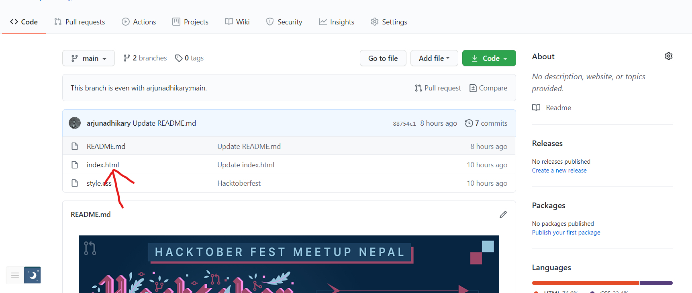
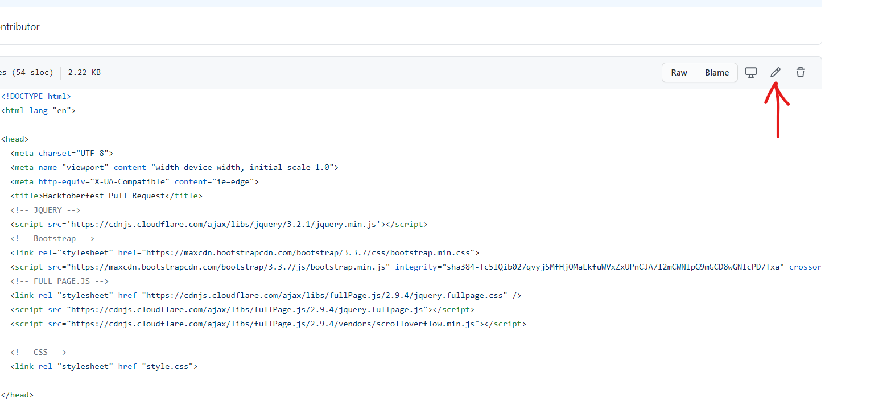
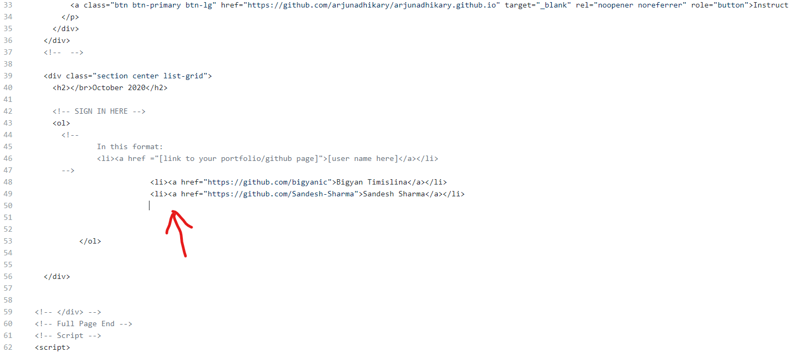
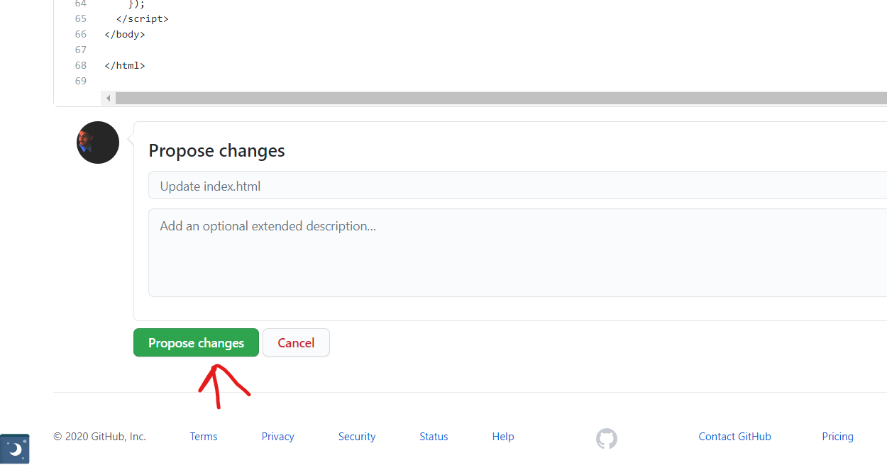
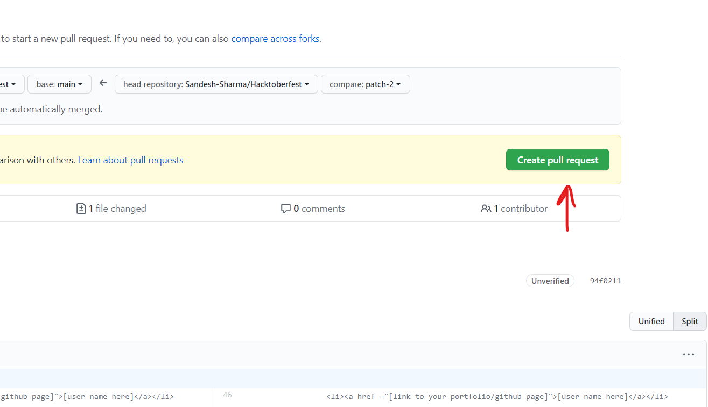
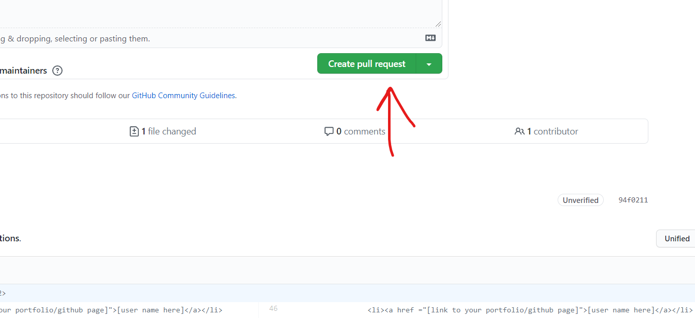

 

    <a href="https://hacktoberfest.digitalocean.com/">
            </img>
</a>
    <a href="https://github.com/Parajulibkrm/Hacktoberfest-Nepal/fork">
            </img>
        </a>   
    

  Built with ❤︎ by
  <a href="https://twitter.com/Codekavya">Code Kavya</a> and
  <a href="https://github.com/arjunadhikary/Hacktoberfest/graphs/contributors">
    contributors
  </a>

  
***  
  
  
<b>Read the instructions below  and make pull requests to win a tshirt from DigitalOcean. Pull requests coming from Hacktoberfest Meetup Nepal will also qualify for free host giveaway. 
        </b>

---

# ❓ What's Hacktoberfest 2020?

Hacktoberfest is the easiest way to get into open source! Hacktoberfest is a month long festival of open source code presented by [Digital Ocean](https://www.digitalocean.com/) and [DEV](https://www.dev.to/) this year in 2020.

During the entire month of October 2020, all you have to do is contribute to any open source projects and open at least 4 pull requests. Yes, any project and any kind of contributions. It can be a be a bug fix, improvement, or even a documentation change! And win a T-Shirt and awesome stickers.

If you’ve never contributed to open source before, this is the perfect time to get started because Hacktoberfest provides a large list of available contribution opportunities (and yes, there are always plenty for beginners too).

---

# 👕 Why Should I Contribute?

Hacktoberfest has a simple and plain moto.

> Support open source and earn a limited edition T-shirt!

So, yes! You can win a T-Shirt and few awesome stickers to attach on your laptop. On plus side, you will get into beautiful world of open source and get the international exposure.  
**Wait there's more!**

> Complete pull requests in repositories listed below and get the chance to win a free unlimited ssd web host.

---

# 👍 This is Awesome! How Can I Contribute?

It's very easy. You don't need to be an expert in coding and programming. Here are the steps you need to follow to create your -(maybe)- EXAMPLE first pull request within few minutes.

1. **Star this repository and Follow me on Github [here](https://github.com/arjunadhikary/).**
2. **Navigate to `index.html` file**
   
3. **Edit the file and insert the line of code in the specified location .**
   
   
4. **Now click on Propose button.**
   
5. **Create a new pull request.**
   
   
6. **Wait for your Pull Request to be reviewed and merged!**
7. **Enjoy and welcome to Hacktoberfest 2020 and Keep Contributing :)**

> Step 2 is required to be eligible for giveaway.

## 🔥 What will happen after my contribution?

I have created a simple page to display all contributors list [here](https://arjunadhikary.github.io), your name should appear shortly after the pull request is merged.
If you have participated in Hacktoberfest Meetup Nepal and created successful pull request in all the repositories mentioned below, you'll be eligible to win a free hosting acount from our sponsor.

---

## 🤗 Other Repositories to contribute to

- [Hacktoberfest-Simple-Practice-Programmes](https://github.com/bigyanic/Hacktoberfest-Simple-Practice-Programmes)
- [the_poetry_forum](https://github.com/Sandesh-Sharma/the_poetry_forum)
- [Hacktoberfest-Nepal-2020](https://github.com/Saugat-Adhikari/Hacktoberfest-Nepal-2020)
- [Hacktoberfest-Nepal](https://github.com/Parajulibkrm/Hacktoberfest-Nepal)
